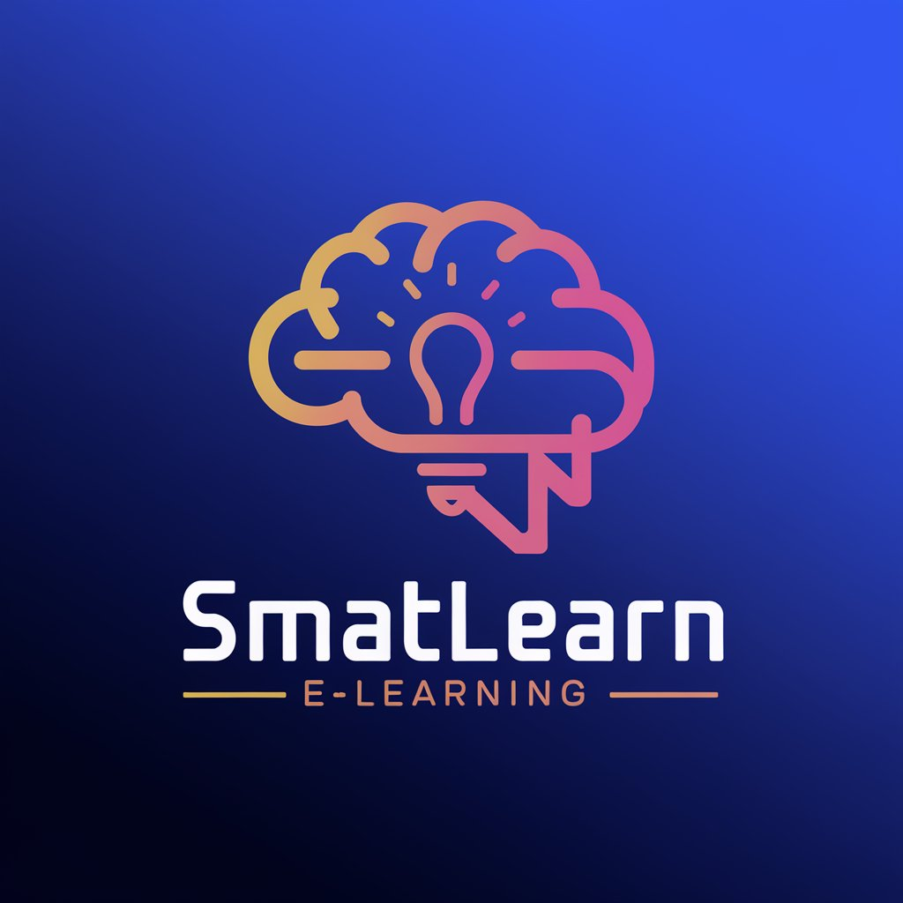

## SmartLearn - Mobile Learning Platform



A Flutter-based mobile application for online learning and course progress tracking.

## Features
- Course enrollment and management
- Progress tracking with visual indicators
- Provider-based state management
- Clean architecture implementation
- Responsive UI components

## Installation
1. Ensure Flutter 3.0+ is installed
2. Clone repository:
```bash
git clone https://github.com/Eva254-ke/e-learning-mobile-app.git
cd elearning_app

## Install Dependencies
Run the following command to install the required dependencies:

```bash
flutter pub get
##Running the app
Run the following command to start the app on an emulator or physical device:

```bash
flutter run -d <device_id>
# Contributing

- Follow **BLoC architecture patterns**.
- Use **Provider** for state management.
- Maintain a clean separation between:
  - **Presentation** (`screens/`)
  - **Business logic** (`providers/`)
  - **Data models** (`models/`)

---

## License

## SmartLearn © 2025. All rights reserved.

- **SmartLearn** is a trademarked by **Eva254-ke**.
- **SmartLearn** is licensed under the **MIT License**.
- You may not use **SmartLearn** for any commercial purpose without obtaining a license from **Eva254-ke**.
- **SmartLearn** is not intended for use in any environment where it may be used to harm or deceive others.
- **SmartLearn** is not intended for use in any environment where it may be proprietary software.